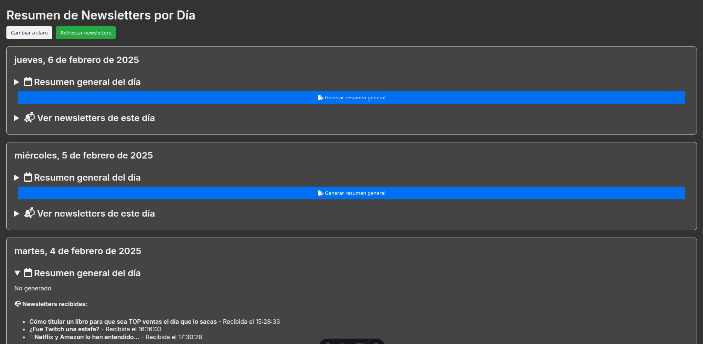

---
# **Newsletter Summarizer**

##  **Descripción**
Newsletter Summarizer es una aplicación que automatiza la recopilación, almacenamiento y análisis de newsletters.
El sistema permite recibir newsletters vía **IMAP**, almacenarlas en una base de datos, y generar **resúmenes automáticos** utilizando **Gemini AI**.

La interfaz ofrece una forma intuitiva de navegar por las newsletters organizadas por día, con opciones para visualizar y generar resúmenes.
---

## 🛠 **Tecnologías utilizadas**

**Backend:**

- **FastAPI** (Framework para la API)
- **SQLAlchemy** (ORM para base de datos)
- **SQLite** (Base de datos ligera)
- **IMAPClient** (Para conexión con ProtonMail IMAP)
- **Gemini AI (Google Generative AI)** (Para generación de resúmenes)

**Frontend:**

- **Astro** (Framework para la web)
- **React** (Interfaz interactiva)
- **ReactMarkdown** (Renderizado de texto en Markdown)

---

## ✨ **Funciones principales**

✅ **Recepción automática de newsletters** a través de **IMAP** (ProtonMail).  
✅ **Almacenamiento y organización en base de datos** (SQLite).  
✅ **Generación de resúmenes automáticos** con **Gemini AI**.  
✅ **Interfaz moderna e intuitiva**, con **modo claro/oscuro** y diseño **responsive**.  
✅ **Vista de newsletters organizadas por día**, con opción de generar un **resumen general** diario.  
✅ **Actualización automática** para detectar nuevas newsletters.

---

## 🎨 **Interfaz de Usuario**

📌 **Lista de días con newsletters**  
📌 **Resúmenes individuales de newsletters**  
📌 **Resumen general diario (colapsable)**  
📌 **Modo claro/oscuro**  
📌 **Botón para refrescar nuevas newsletters**

_Ejemplo de UI:_

    
    

---

## **Próximas mejoras**

**Filtrado por remitente**  
**Búsqueda por palabras clave**  
**Exportación de resúmenes**  
**Soporte para múltiples cuentas de correo**

---
